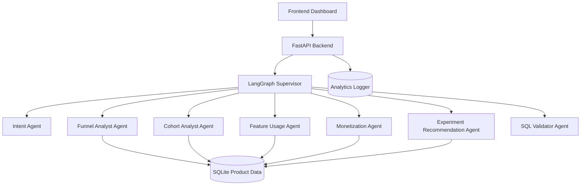

# TrialLift

TrialLift is a multi-agent product analytics platform for SaaS teams that identifies why trial users fail to convert to paid customers.

It uses a LangGraph supervisor to route product analytics questions to specialist agents for funnel analysis, cohort comparison, feature usage analysis, monetization opportunity detection, and experiment recommendation. The system validates SQL before execution, logs token usage and user interactions, and uses a configurable company profile to personalize recommendations.

## Why This Project

This capstone is designed to demonstrate both data analytics and software engineering skills.

For data analyst roles, it shows funnel analysis, cohorts, conversion metrics, SQL, product analytics, and business recommendations.

For software engineering roles, it shows LangGraph supervisor orchestration, backend architecture, SQL validation, analytics event logging, state management, token optimization, and failure handling.

## Architecture



## Multi-Agent Pattern

TrialLift uses a supervisor orchestration pattern.

The supervisor inspects the user's question, routes it to the best specialist agent, validates SQL before execution, retries invalid agent output once, and falls back to a general analytics agent if routing fails.

## Agents

| Agent | Responsibility |
| --- | --- |
| Intent Agent | Classifies the user's analytics question |
| Funnel Analyst Agent | Finds conversion drop-offs across trial funnel events |
| Cohort Analyst Agent | Compares conversion by signup cohort and segment |
| Feature Usage Agent | Analyzes feature adoption and activation behavior |
| Monetization Agent | Finds pricing, checkout, and plan upgrade opportunities |
| Experiment Recommendation Agent | Suggests A/B tests based on analytics findings |
| SQL Validator Agent | Blocks unsafe SQL and allows only read-only analytics queries |
| Fallback Agent | Produces a general answer when specialist routing fails |

## State Management

TrialLift starts with shared global state because the capstone uses a supervisor pattern with a controlled set of agents.

Each agent can read the full graph state, but writes only to specific keys:

| State Key | Written By |
| --- | --- |
| `question` | API layer |
| `company_profile` | API layer |
| `intent` | Intent Agent |
| `sql` | Specialist agents |
| `rows` | SQL execution step |
| `answer` | Specialist or fallback agent |
| `token_usage` | Supervisor and logger |
| `errors` | Validator, retry, and fallback steps |

## Failure Handling

TrialLift includes three failure-handling mechanisms:

1. SQL validation blocks destructive queries.
2. Invalid outputs are retried once with a stricter prompt.
3. A fallback analytics agent responds if a specialist route fails.

## Token and Cost Controls

Recruiters often look for evidence that an AI project controls cost. TrialLift includes:

- deterministic SQL templates for common analytics questions
- short agent prompts
- route-first orchestration to avoid calling every agent
- token usage estimation per request
- persistent analytics logs for question, intent, latency, token estimate, and selected agent

## Dataset

The mock SaaS dataset includes:

- `users`
- `organizations`
- `plans`
- `subscriptions`
- `events`
- `feature_usage`
- `experiments`
- `analytics_logs`

Example events include:

- `signed_up`
- `created_workspace`
- `invited_teammate`
- `connected_integration`
- `created_project`
- `exported_report`
- `viewed_pricing`
- `started_checkout`
- `upgraded_to_paid`
- `cancelled_trial`

## Run Locally

Create a virtual environment and install dependencies:

```bash
pip install -r requirements.txt
```

Seed the database:

```bash
python scripts/seed_db.py
```

Start the API:

```bash
uvicorn app.main:app --reload
```

Open the dashboard:

```bash
streamlit run dashboard/streamlit_app.py
```

## Example Questions

- Why are trial users not converting?
- Compare conversion for SMB and mid-market cohorts.
- Which features are most associated with paid upgrades?
- Where is the checkout funnel leaking?
- Recommend experiments to improve trial conversion.

## API Example

```bash
curl -X POST http://localhost:8000/analyze \
  -H "Content-Type: application/json" \
  -d "{\"question\":\"Why are trial users not converting?\"}"
```

## Project Structure

```text
app/
  agents/
  core/
  data/
  main.py
dashboard/
scripts/
tests/
```

